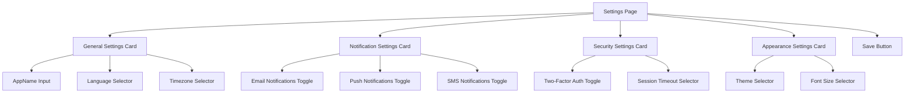
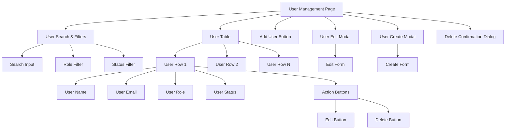
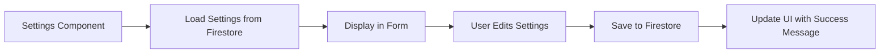

# Component Architecture

## Settings Page Structure



## User Management Page Structure



## File Structure

```
src/
├── components/
│   ├── settings/
│   │   └── Settings.tsx
│   ├── users/
│   │   └── UserManagement.tsx
│   └── ... (existing components)
├── services/
│   ├── userService.ts
│   └── declarationService.ts
└── ... (other directories)
```

## Data Flow

### Settings Page Data Flow



### User Management Data Flow

```mermaid
graph LR
    A[UserManagement Component] --> B[Load Users from Firestore]
    B --> C[Display in Table]
    C --> D1[User Searches/Sorts]
    C --> D2[User Edits Record]
    C --> D3[User Creates Record]
    C --> D4[User Deletes Record]
    
    D1 --> E1[Filter/Sort Data]
    D2 --> E2[Update User in Firestore]
    D3 --> E3[Create User in Firestore/Auth]
    D4 --> E4[Delete User from Firestore/Auth]
    
    E1 --> F1[Update Table]
    E2 --> F2[Update Table Row]
    E3 --> F3[Add New Row to Table]
    E4 --> F4[Remove Row from Table]